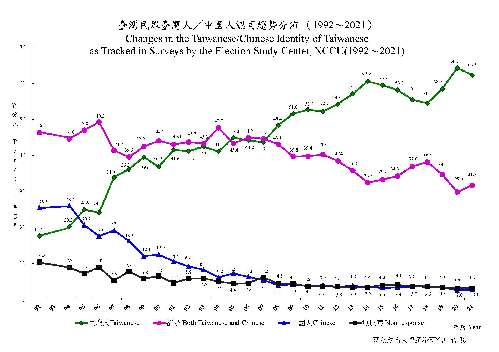

```{r setup, include=FALSE}
knitr::opts_chunk$set(
	echo = FALSE,
	message = TRUE,
	warning = FALSE
)
```


# 認識效果量

> 講義的[源始Rmd](Lecture01.Rmd);種子教師工作坊請下載[作業Rmd](files/Lecture01HW.Rmd)

<!--- 
這份講義以Ellis (2010) Chapter 1,2為組織主幹，搭配相關資源隨教學歷史更新。講義內容將透過種子教師工作坊的指派作業持續更新完善。
--->


- 已被發明的效果量指標達到70多種(Kirk, 2003)
- **效果**在學術情境與日常生活有用辭差異
- 效果量指標的選擇取決於研究者的知識論


# 兩大效果量指標家族

## d family ~ difference between groups

- 透過至少一種間斷變項設定比較條件，測得的比較數值差異。
- 差異：各資料點與**期望數值**的距離

::: fragment
> 舉例~<br>蘇格拉底教授平均一堂課當掉80%的學生; 柏拉圖教授平均一堂課當掉50%的學生。不同立場的期望數值決定兩位教授的評價。
:::

<!---

- Groups compared on dichotomous outcomes


- The risk difference in probabilities

- The relative risk

- The odds ratio

- Groups compared on continuous outcomes

- Cohen’s d

- Glass’s delta( $\triangle$ )

- Hedges’ g 

- Probability of superiority

--->

## r family ~ measures of association

- 變項之間關聯性的測量
- 關聯性：各資料點距離各變項**集中量數**的差異乘積

::: fragment
> 維基百科依變項尺度再分類為兩個家族
:::

<!---

#### Correlation indexes

(Two variables are continuous)

- The Pearson product moment correlation coefficient ($r$) 


(Two variables are ordinal)

- Spearman’s rho or the rank correlation coefficient ($\rho$)

- Kendall’s tau ($\tau$)

(One continous and one ordinal)

- The point-biserial correlation coefficient ($r_{pb}$)

(Contigency table)

- The phi coefficient ($\phi$)

- Pearson’s contingency coefficient (C)

- Cram´er’s V (V)

- Goodman and Kruskal’s lambda ($\lambda$)


#### Proportion of variance indexes

- The coefficient of determination ($r^2$)


- the (uncorrected) coefficient of multiple determination ($R^2$$)


- the coefficient of multiple determination adjusted for sample size and the number of predictor variables ($_{adj}R^2$$)


- Cohen’s f ($f$)


- Cohen’s f squared


- Epsilon squared ($eps^2$)


- the (uncorrected) correlation ratio ($\eta^2$)


- Omega squared ($\omega^2$)


- The squared canonical correlation coefficient ($R^2_C$)

--->


# 什麼是有顯著效果的研究


- 實用顯著性(practical significance): 現實世界能讓人感到變化的事物作用
- 統計顯著性(statistical significance): 資料分析顯示極低機率不會發生的作用

::: fragment
> Kirk (1996): 某種延緩阿滋海默症患者智力退化的療程測試，找來6名患者接受測試，另外6名接受對照療程。經過一段時間，接受測試療程的患者智力測驗平均分數比對照療程高13分，統計檢定t = 1.61, p  = .14。這種結果無統計顯著性，但是沒有實用顯著性嗎？
:::

## 

示範[`effectsize`](https://easystats.github.io/effectsize/)套件，轉換t統計值為Cohen's d

```{r t_to_d, echo=TRUE}
## Run the below code for requirement
## install.packages("effectsize")

effectsize::t_to_d(1.61, 10)
```

<!---

## 實例：Easiness effect of reading plain summary

>   (editing)
請下載這份[檔案](https://raw.githubusercontent.com/SCgeeker/LAB_metaprojects/main/Projects/202102_PL/0_reproduced_practice/2_power_simulation.html)以及開啟這份[研究論文](https://online.ucpress.edu/collabra/article/7/1/18898/116069/Straight-From-the-Scientist-s-Mouth-Plain-Language)

--->

# 效果量是什麼？

- 現實世界的社會科學聽眾只會關心實用顯著性。
- 效果量(effect size)是專業研究結果與通俗說明的中介載體。
- 當代社會科學學術寫作指南均有建議如何報告效果量。


## 

- 理想的效果量測量以發生作用的母群為對象，現實考量只能取得隨機樣本進行測量，形成測量誤差與精確性等研究方法課題。
- 講究實用顯著性，效果量大小是重點；講究統計顯著性，效果量測量精確性是關鍵。

- 日常生活的成年人士依賴效果量大小資訊做出各種判斷

::: fragment
> 你自已有興趣或想研究的主題，有什麼明確的效果量描述？
:::

<!---
> 早鳥預訂讓你省下多少%
> [跳繩10分鐘相當於做什麼運動](https://www.edh.tw/article/7328)
--->

## 為何研究報告要呈現效果量？

**Ellis (2010) Box 2.1 測試兩大科幻族群的忠誠度**

||N|Mean|SD|t|p|Cohen's d|
|:---:|:---:|:---:|:---:|:---:|:---:|:---:|
|Study 1|||||||
|星戰粉|15|25|9|1.52|>.05| 0.56 |
|星艦迷|15|20|9||||
|Study 2|||||||
|星戰粉|30|25|9|2.15|<.05| 0.56 |
|星艦迷|30|20|9||||

- 只呈現統計顯著性但不呈現效果量，會導致研究者誤解研究結果。

# 報告效果量的三個建議

::: fragment
> 所有統計分析輸出的效果量只是真實效果量的估計值！
:::

1. 明確說明使用的效果量指標

2. 以**信賴區間**表示效果量測量結果的精確性

::: fragment
> d = 0.25 95%CI [0.6 0.41]
:::

3. 儘可能不要使用術語報告效果大小


# 解讀效果量有多麼不容易

::: fragment
<small>一種效果量的陳述，對**不同族群**有不同意義。</small>
:::

::: fragment

:::

##

- 效果量的解讀必定涉及價值判斷。
- 處理第一手資料的研究者有義務報導能充分解讀效果量的所有統計資訊。


<!--- 
臺灣民眾臺灣人/中國人認同趨勢分佈(1992年06月~2021年12月)
https://esc.nccu.edu.tw/PageDoc/Detail?fid=7804&id=6960
--->

##  

- **心理學的效果量解讀需要更多功夫的主要原因**，是因為大多研究結果是根據潛在變項編製的量表，綜合測得的分數推測可能不存在的假設性感知，與人類的感知世界無直接關聯性。

::: fragment
> 正向心理學的減憂鬱療程(Woodworth et al., 2018)：**CESD憂鬱感量表** <br> 共有20題，4選項單選題，其中4題是反向題
:::

# 解讀效果量的線索 

- 研究問題的脈絡
- 更新知識的貢獻
- Cohen指南

## 研究問題的脈絡

- 微小效果量在合理的脈絡有巨大意義：疫情二級警戒期間，學校有兩位人員確診，要立即停課。

- 少數事件造成的效果可能引發更影響更大的事件：數千公里外的海底火山爆發，幾小時後可能會發生海嘯。

- 微小效果積少成多可能帶來巨大改變：棒球隊勝率與球員打擊率的正相關。

- 微小效果的發現在關鍵時機帶來技術革新或觀念更新：[1854 Broad Street cholera outbreak](https://w.wiki/4prL)

## 更新知識的貢獻

- 再現研究與過去研究估計的效果量不一致：研究操作的不同？測量對象的特質不同？新研究是新發現？

- 不同時空測得的效果量貢獻獨特的意義：整合分析(meta analysis)總和不同研究的效果量估計。

- 更嚴謹的最新研究所估計的效果量，能更新理論的逼真度(Verisimilitude, Scheel et al., 2021)


## Cohen指南

<!---
效果量大小分級表(Ellis, 2010 Table 2.1)
--->

<small>適用場景：(1)新開創的研究問題；(2)保守預測重製研究的結果</small>

|Test|Effect size index|small size|medium size|large size|
|---|---|:---:|:---:|:---:|
|Comparison of independent means|$d, \triangle, Hedges'g$|.20|.50|.80|
|Comparison of two correlations|q|.10|.30|.50|
|Difference between proportions|Cohen's g|.05|.15|.25|
|Correlation|r|.10|.30|.50|
||$r^2$|.01|.09|.25|
|Cosstabulation|$w, \phi, V, C$|.10|.30|.50|
|ANOVA|$f$|.10|.25|.40|
||$\eta^2$|.01|.06|.14|
|Multiple regression|$R^2$|.02|.13|.26|
||$f^2$|.02|.15|.35|

