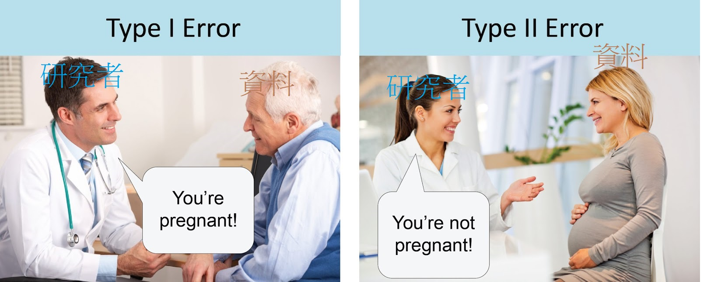

```{r setup, include=FALSE}
knitr::opts_chunk$set(
	echo = FALSE,
	message = TRUE,
	warning = FALSE
)
```

# 啟動問題

> 講義的[源始Rmd](Lecture02.Rmd);所有課程學員請下載[作業Rmd](files/Lecture02HW.Rmd),種子教師工作坊請下載[增能指引](files/Lecture02after.md)。

> 本講參考資源：Ellis(2010) Chapter 3; Psyteacher APES [章節1](https://psyteachr.github.io/analysis-v2/apes---alpha-power-effect-sizes-sample-size.html)與[章節2](https://psyteachr.github.io/quant-fun-v2/power-and-effect-sizes.html)

<!---
 本講以Ellis(2010)第三章為主幹，補充更新的教程及建議。
--->

##

我的研究需要收集多少資料才能得到**有意義**的結果？<br/><br/>

我能運用的研究資源足夠收集可支持研究假設的資料嗎？

# 研究風險來源

| Null | Alternative |
|:---:|:---:|
|虛無假設 | 對立假設|
| No effect | A detectable effect |
| 假設存在的效果在測量尺度為0 | 假設存在的效果在測量尺度非0 |
|  <font color="red">實際的效果為0，結論宣稱非0</font> | <font color="red">實際的效果非0，結論宣稱為0</font> |

- **我有興趣的是那個假設？**

- **我了解想要測試的效果，有事前評估偵測到效果的條件嗎？**


## 分析結果出錯的風險




- Play [Understanding Statistical Power and Significance Testing](https://rpsychologist.com/d3/nhst/) by Kristoffer Magnusson


## 使用統計檢定不管風險的缺陷(Ellis, 2010; Box 3.1)

<!---
 本講摘要Ellis(2010) Box 3.1
--->

1. 考驗力接近封頂(100%)，任何統計檢定都能顯著。**未設想虛無假設的背景，統計顯著即無意義。**

2. 以p value有沒有小於顯著水準，決定結果有沒有意義。**忽略p value的連續性。**

3. 效果量與樣本數都會影響p value。**過度簡化必定低估或高估p value的意義。**

4. 統計顯著不代表預期的效果真實存在。**不提醒學習者很容易造成誤用統計檢定。**


## 延伸閱讀

- 想了解更多近年討論，推薦從美國統計學會公開聲明入門。
- Wasserstein, R. L., & Lazar, N. A. (2016). The ASA’s Statement on p-Values: Context, Process, and Purpose. The American Statistician, 70(2), 129–133. https://doi.org/10.1080/00031305.2016.1154108
- 有教授或討論統計方法的課程，應引用相關討論的文章或講演資訊。 \#HW01


# 評估風險必知

1. $\alpha$, $\beta$ 是彼此獨立的條件機率

::: fragment
**Type I error**<br/>

> 實際的效果為0，根據分析結果宣稱非0 <br>
> $\alpha = p(\frac{d \neq 0}{\theta = 0})$

:::


::: fragment
**Type II error**<br/>

> 實際的效果非0，根據分析結果宣稱為0 <br>
> $\beta = p(\frac{d = 0}{\theta \neq 0})$

:::

## 2. $\alpha$/$\beta$ 那種風險損失較嚴重？


- 證實必定有效的結果/否證實際不存在的效果所耗費的沈默成本？

- 效果量偏低，獲得統計顯著結果的益處是什麼？

- 現實資源能否支持$\frac{\alpha}{\beta}$平衡損益？

## 3. 什麼是合適的$\alpha$/$\beta$

- Cohen's suggested balance ~ $\frac{\alpha}{\beta} = \frac{1}{4}$

- $\alpha < .05$, $1 - \beta$至少.80

- “The notion that _failure to find_ is less serious than _finding something_ that is not there accords with the conventional scientific view” (Cohen, 1988)

- Motivation for **p-hacking**

## 

||There is no effect<br>(null=true)|There is an effect<br>(null=false)|
|:---:|:---:|:---:|
|We claim no effect<br>(ES=0)|Correct conclusion<br>($1 - \alpha$)|Type II error<br>($\beta$)|
|We claim an effect<br>(ES $\neq$ 0)|Type I error<br>($\alpha$)|Correct conclusion<br>($1 - \beta$)|
||Universe X|Universe Y|

- 為研究結果負責的研究者，應該有能力判斷最合適的$\frac{\alpha}{\beta}$

- **發表偏誤(publication bias)**極有機會導致$\alpha$被低估

- 可重製研究通常要求$1 - \beta$ 至少達到 .90。參考[Nature Human Behaviour](https://www.nature.com/nathumbehav/submission-guidelines/registeredreports)、[Collabra: Psychology](https://drive.google.com/file/d/1mApMxCmFH2GFd3m-qiw89y6rLjUDRDdY/view)等期刊的註冊報告投稿指南。


# 考驗力分析概論

<style>
.container{
  display: grid;
  grid-auto-flow: column;
}
</style>


::: {.container}
:::: {.col}
[](https://psyteachr.github.io/quant-fun-v2/power-and-effect-sizes.html#designing-studies)
::::
:::: {.col}
- A ~ $\alpha$
- P ~ Power
- E ~ Effect size
- S ~ Sample size
- 知道其中三個就能估算另一個
- Play again [Understanding Statistical Power and Significance Testing](https://rpsychologist.com/d3/nhst/) 
::::
:::

## 考驗力分析實作取向

|Prior power analysis|Post-hoc power analysis|
|:---:|:---:|
|A,P,E -> S <br> **A,P,S -> E** <br> P,E,S -> A | A,E,S - > P  |

- [Psyteachr resource list](https://psyteachr.github.io/analysis-v2/apes---alpha-power-effect-sizes-sample-size.html#useful-links)

- 效果量指標可[互相轉換](https://www.escal.site/)，或運用已知資訊計算。

- 各種研究場域都有合適的APES估算工具，研究者應以**現實需要**選擇工具。

<!---
- > 單一獨變項比較或兩個自變項相關性等簡單實驗設計，都可運用[G*Power](https://stats.oarc.ucla.edu/other/gpower/)處理考驗力分析。超出規格的設計，例如有隨機效果(random effect)的設計，應使用能生成模擬數據的工具。
--->

# Examples of power analysis 

演練範例之前，請先下載[作業Rmd](Lecture02HW.Rmd)以及確認安裝R套件`effectisize`及`pwr`。


## 

功用1: 預估得到有統計意義結果需要的樣本數

> Kirk (1996): 某種延緩阿滋海默症患者智力退化的療程測試，找來6名患者接受測試，另外6名接受對照療程。經過一段時間，接受測試療程的患者智力測驗平均分數比對照療程高13分，統計檢定t = 1.61, p  = .14。要得到考驗力達.80的.05顯著結果，需要多少受測者？

- 請先查閱`pwr::pwr.t.test`說明文件。

## 

```{r Kirk1996_demo001A, echo=TRUE}
## This example is from Kirk(1996): A researcher tested the medication that might raise the IQ of people suffering from Alzheimer's disease.

## two tailed test
pwr::pwr.t.test(d=unlist(effectsize::t_to_d(1.61, 10))["d"],
                power = .80,
                type = "two.sample",
                alternative = "two.sided")

```

##

```{r Kirk1996_demo001B, echo=TRUE}
## This example is from Kirk(1996): A researcher tested the medication that might raise the IQ of people suffering from Alzheimer's disease.

## one tailed test
pwr::pwr.t.test(d=unlist(effectsize::t_to_d(1.61, 10))["d"],
                power = .80,
                type = "two.sample",
                alternative = "greater")
```

## 

功用2: 以現有資料估計現有資訊可達到的考驗力

```{r Kirk1996_demo002, echo=TRUE}
pwr::pwr.t.test(n=6,
                d=unlist(effectsize::t_to_d(1.61, 10))["d"],
                type = "two.sample",
                alternative = "two.sided")
```

##

功用3: 設定合理的顯著水準


```{r Kirk1996_demo003A, echo=TRUE}
pwr::pwr.t.test(n=6,
                d=unlist(effectsize::t_to_d(1.61, 10))["d"],
                type = "two.sample",
                sig.level = NULL, 
                power = .80,
                alternative = "two.sided")
```

##

```{r Kirk1996_demo003B, echo=TRUE}
pwr::pwr.t.test(n=6,
                d=unlist(effectsize::t_to_d(1.61, 10))["d"],
                type = "two.sample",
                sig.level = NULL, 
                power = .80,
                alternative = "great")
```

##

功用4: 設計有高考驗力的再現研究

> 兩件探討同一組變項的相關研究分別報告不顯著的相關係數.2及.24，樣本數分別為78與63。這兩件研究的考驗力分別達到多少？要設計能達到.80考驗力的研究需要多少樣本數？


事前分析評估的最適樣本數，不代表研究結果必定達到設定的統計顯著。

##

```{r design_demo001A, echo=TRUE}
pwr::pwr.r.test(n=78, r=.2)
pwr::pwr.r.test(n=63, r=.24)
```

##

設定成功的再現研究應發現r = .22。

```{r design_demo001B, echo=TRUE}
power <- NULL

for(size in seq(70,160,10)){

power <- c(power, round(as.numeric(unlist(pwr::pwr.r.test(n=size, r=.22))["power"]), 2)) 
}

pwr_report <- data.frame(
  size=seq(70,160,10),
  power
)
```

##

`r knitr::kable(pwr_report)`


# 估計研究設計需要的樣本數

## 設定樣本數的策略

- 研究設計有文獻資料參考，可運用整合分析(meta analysis)估計可能的效果量，評估所需樣本數

- 研究設計無文獻資料參考，可執行敏感度分析(sensitivity analysis)設定合理的樣本數。

##

> 設定$\alpha = .05$的獨立樣本雙尾檢定比較，達到指定考驗力80%所需最少樣本數。

```{r effect_size, echo=TRUE}

d_t <- seq(.1,1,.1)

n_t <- NULL

for(i in 1:length(d_t)){
n_t <- c(n_t,round(as.numeric(unlist(pwr::pwr.t.test(d=d_t[i],
                power=.80,
                type="two.sample",
                alternative = "two.sided"))["n"]))*2)
}

tb <- data.frame(
    ES = d_t,
    Interpretation = effectsize::interpret_cohens_d(d_t),
    N = n_t
  )
```


##

`r knitr::kable(tb)`

$$N = N_1 + N_2$$

## 最小可偵測效果量

- 以現用資源能收集到的樣本數，評估指定考驗力能偵測的效果量

- 又稱**最小有意義效果量**(smallest effect size of interest, **SESOI**)

- 延伸閱讀: [Anvari and Lakens (2021)](https://linkinghub.elsevier.com/retrieve/pii/S0022103121000627), [Lakens (2022)](https://online.ucpress.edu/collabra/article/8/1/33267/120491/Sample-Size-Justification) \#HW2

##

> 簡單迴歸範例

```{r simpe-reg, echo=TRUE}
## simple regression
pwr::pwr.r.test(n=100,
                power = .8,
                alternative = "two.sided")
```

##

> 多元迴歸範例

```{r multi-reg, echo=TRUE}
pwr::pwr.f2.test(u = 5, ## potential number of variables
                 v = (200-5-1),  ## adjusted sample size
                sig.level = .05^5,
                power=.8)
```

# 教師增能作業

種子教師工作坊請下載請下載[增能指引](files/Lecture02after.md)，延續學習成果。

<!---

Blocked in 0527 workshop

# 考驗力與測量精確度

- 效果量估計值要包括信賴區間的主要理由：不只以平均值歸類效果量的大小。

## 測量誤差的來源與對策

- 相關分析經常因測量誤差導致相關係數被低估
- 量表項目一致性可用來校正相關係數估計值
- 相關係數估計值若未校正，很可能錯估考驗力 ~ Ellis (2018) Table 3.4


#　考驗力分析的R套件

### `pwr` 

- 根據研究設計與指定考驗力，估計可測得的效果量最小樣本數
- 根據研究設計與指定考驗力，估計目標樣本數可測得的合理效果量


### `effectsize` 

- 轉換效果量指標


# post hoc power analysis


- 通常分析事後考驗力無太大意義

- 低考驗力的無顯著結果難以得到肯定效果存在結論

## 不顯著結果的事後考驗力分析為何無意義

- 低考驗力研究得到的效果量估計值通常不精確，特別是小樣本易受抽樣偏誤扭曲。

- 不顯著的p值越高，考驗力越低。

- 不顯著的結果無法判斷目標效果究竟有沒有存在。

## 顯著結果的事後考驗力分析為何有意義

- 偵測發表偏誤

- 檢驗研究者的QRP：[p Curve](https://www.p-curve.com/); [z Curve](https://replicationindex.com/2020/01/10/z-curve-2-0/)


--->