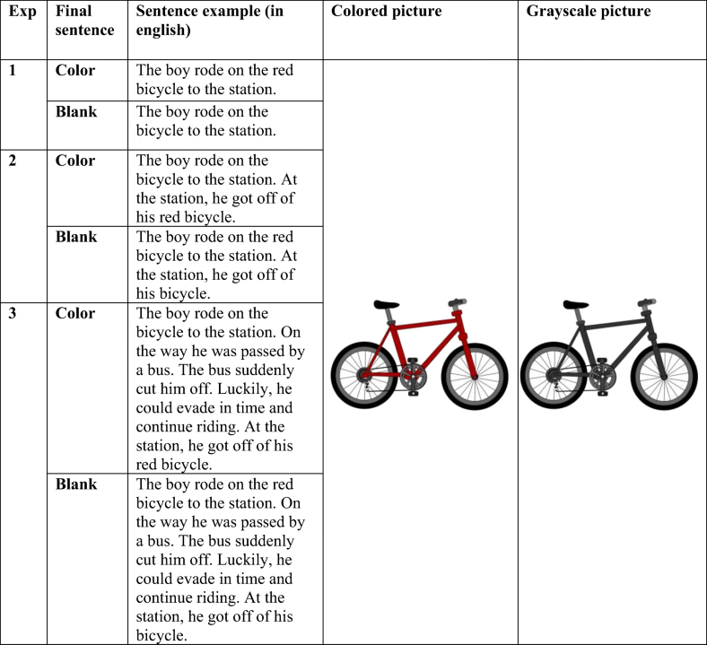
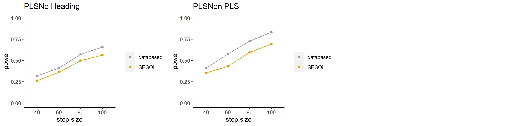

```{r setup, include=FALSE}
knitr::opts_chunk$set(
	echo = FALSE,
	message = TRUE,
	warning = FALSE
)
library(effectsize)
library(tidyverse)
```

# 上課互動平台

請以github帳號登入[github討論串](https://github.com/Rstat-project/seed_courses/discussions/5)。<br/><br/>
有關內置圖表的R程式碼，請下載[講義Rmd](Lecture03.Rmd)。


# 主題

1. 心理科學研究欠缺可重製性/低考驗力的現況
2. 透明化操作與可重製性保障: 案例分析
3. 透明化操作示範及討論: [Datawiz beta](https://datawiz2.dev.zpid.de/)示範


# 學習目標

> 1/3 評估與解讀效果量 

- 估計與解讀研究指標的效果量

> 2/3 設計有高考驗力的研究

- 設定最小有意義效果量及樣本數

> 3/3 提高研究可重製性的透明化操作

- 保障研究的可重製性

## 預估重製研究效果量的合適模式Part 1

**你認為那種資訊能獲得最充分的效果量估計值？**  

>- 根據報告的統計數值(t,F,效果量指標,各變項平均值...)
>- 根據測量單位的估計值(參與者平均值,項目平均值...)
>- 根據原始觀察值(參與者各項目反應紀錄...)


# 文獻考驗力調查

- 2010年之前：文獻回顧
- 2010年之後：文獻回顧 + 合作協作研究 + 預先註冊

## 2010年之前

<p style="font-size:60%;">**Ellis (2010)彙整社會科學各領域研究報告達到的考驗力。**<p/>
<p style="font-size:60%;">**以效果量低中高標計算檢定結果的平均事後考驗力。**<p/>


## 2010年之後

<p style="font-size:60%;">[Schäfer and Schwarz (2019)](https://www.frontiersin.org/articles/10.3389/fpsyg.2019.00813/full) 陳列各領域研究報告顯著結果次數，旁註效果量低中高標。<br/>**無預先註冊的心理學研究有高估效果量的傾向。**</p>


# 可重製研究至今的發展狀況

- 評估心理科學研究品質的方法不斷增加。
- 更新心理科學研究觀念與操作手法的速度不夠快。


## 預估重製研究效果量的合適模式Part 2

>- 根據報告的統計數值(t,F,效果量指標,各變項平均值...)
>- 根據測量單位的估計值(參與者平均值,項目平均值...)
>- 根據原始觀察值(參與者各項目反應紀錄...)


# 透明化操作案例分析


<p style="font-size:40%;">Source: [Australian Reproducibility Network materials, Holcombe(2020)](https://osf.io/xkpq8/?view_only=)</p>

## 案例一：[Hoeben Mannaert et al. (2021)](https://doi.org/10.3758/s13421-020-01078-6) 物件色彩的心智模擬

<!---
<style>
.container{
  display: grid;
  grid-auto-flow: column;
}
</style>
--->


```{r echo=FALSE, fig.height=300}

```


## 案例一主要效果量重製分析


```{r case1, message=FALSE, warning=FALSE, include=FALSE}
orig_results_wide <- read_csv("files/data_long.csv")

orig_sum <- orig_results_wide %>% 
  pivot_wider(names_from = Picture, values_from = c(RT,Accuracy)) %>%
  mutate(RT_d = RT_Color - RT_Gray, Accuracy_d = Accuracy_Color - Accuracy_Gray) %>%
  group_by(Experiment, Sentence) %>%
  summarise(N = n(), RT_d = paste0(round(mean(RT_d)),"(",  round(sd(RT_d)), ")"), 
            Acc_d = paste0(round(mean(Accuracy_d),2),"(",round(sd(Accuracy_d),2),")"))

Cohen_d = c(
round(unlist(effectsize::cohens_d(RT ~ Picture, data = subset(orig_results_wide, Experiment == "1" & Sentence == "Color"), paired = TRUE))[c(1)],2),
round(unlist(effectsize::cohens_d(RT ~ Picture, data = subset(orig_results_wide, Experiment == "1" & Sentence == "Blank"), paired = TRUE))[c(1)],2),
round(unlist(effectsize::cohens_d(RT ~ Picture, data = subset(orig_results_wide, Experiment == "2" & Sentence == "Color"), paired = TRUE))[c(1)],2),
round(unlist(effectsize::cohens_d(RT ~ Picture, data = subset(orig_results_wide, Experiment == "2" & Sentence == "Blank"), paired = TRUE))[c(1)],2),
round(unlist(effectsize::cohens_d(RT ~ Picture, data = subset(orig_results_wide, Experiment == "3" & Sentence == "Color"), paired = TRUE))[c(1)],2),
round(unlist(effectsize::cohens_d(RT ~ Picture, data = subset(orig_results_wide, Experiment == "3" & Sentence == "Blank"), paired = TRUE))[c(1)],2))

orig_sum = cbind(orig_sum, Cohen_d)
```

`r knitr::kable(orig_sum)`


## 案例一重製成本評估


```{r effect_size, echo=FALSE}

## effect size from study 1 to 3 of Hoeben Mannaert et al. (2021)
d_t <- c(.12,.35,.46)
## we estimated 80, 90, 100, 110, 120 participants
n_t <- seq(30,120,10)

power_t <- NULL

for(i in 1:length(d_t)){
  for(j in 1:length(n_t)){
    power_t <- c(power_t,round(as.numeric(unlist(pwr::pwr.t.test(d=d_t[i],
                n=n_t[j],
                type="paired",
                alternative = "two.sided"))["power"]),3))
  }
}

tb <- data.frame(
    ES = rep(d_t,each=length(n_t)),
    N = rep(n_t,length(d_t)),
    Power = as.factor(power_t)
  )

ggplot(data=tb,aes(x=N,y=Power,color=ES))+
  geom_point() 
```

<p style="font-size:40%;">設定$\alpha = .05$的相依樣本雙尾檢定比較，根據已知效果量預估值，評估各種樣本量能達到的考驗力。</p>


## 案例一原始研究公開資料

- 預先註冊計畫與實驗材料：[Exp 1 & 2](https://osf.io/f3tu2/), [Exp 3](https://osf.io/bfm6p)

- [全部實驗平均反應值資料](https://osf.io/emgya)

## 評論案例一資料公開程度

- 有各實驗預先註冊計畫
- 有實驗刺激句、圖像檔案列表
- 公開資料有參與者各條件平均反應時間及正確率
- 公開資料無參與者各試驗反應資料
- 公開資料無資料編碼薄

> 

- 公開資料是寬表單格式(wide table)，無法直接驗證研究品質。

## 案例二：[(Kerwer et al., 2021)](https://doi.org/10.1525/collabra.18898) 簡易效應(Easiness effect)

> "一般讀者閱讀淺顯易懂的(學術論文)白話摘要之後，傾向高估文本資訊的可信度（Credibility），膨脹判讀資訊真實性的信心（Confidence to evaluate），以及高估個人專業判斷能力（Ability to make decision）等三種感受。"[(張祥偉等, 投稿中)](https://psyarxiv.com/uge6k/)

- Credibility = 信賴感
- Confidence to evaluate = 真實感
- Ability to make decision = 專業感

## 案例二原始與重製結果


<p style="font-size:50%;">[重製研究專案介紹](https://tcpsr.netlify.app/project/pls_rep/)</p>


## 重製研究的考驗力分析

>- <p style="font-size:50%;">相對於學術摘要的考驗力曲線</p>

|信賴感||
|:---:|:---:|

##

|真實感||
|:---:|:---:|

## 

|專業感||
|:---:|:---:|

- <p style="font-size:50%;">下載[考驗力分析報告](https://osf.io/dqkw7)</p>


## 案例二原始研究公開資料

- [預先註冊計畫](http://dx.doi.org/10.23668/psycharchives.2772)與[實驗問卷及資料公開庫](https://osf.io/A9QSY/)

- [原始反應資料](https://osf.io/b34fj)
- [原始反應資料編碼薄](https://osf.io/q4chk)

## 評論案例二資料公開程度

- 有各實驗預先註冊計畫
- 實驗刺激來自公開資訊(原始論文)
- 公開資料有參與者各試驗反應資料
- 公開資料有資料編碼薄


## 預估重製研究效果量的合適模式Part 3

>- 根據報告的統計數值(t,F,效果量指標,各變項平均值...)
>- 根據測量單位的估計值(參與者平均值,項目平均值...)
>- 根據原始觀察值(參與者各項目反應紀錄...)


# 透明化操作示範

[Datawiz](https://datawiz2.dev.zpid.de/)是由The Leibniz Institute for Psychology (ZPID)開發的一項專案，協助心理科學研究者整理研究資料能符合[FAIR科學資料管理原則](https://www.go-fair.org/fair-principles/)。

- 專案人員的[工作坊講義](https://psycharchives.org/en/item/066dfbfd-4a49-4069-a257-7eeb919c9f4e)。

## 註冊

- 點選[Datawiz首頁](https://datawiz2.dev.zpid.de/)右上角*[Login]*
- 點選**Register here!**，註冊"Leibniz Psychology account"
- 回覆確認信成功，以"Leibniz Psychology account"登入。

## 示範資料

下載[Hoeben Mannaert et al. (2021)長表單資料](files/data_long.csv)。

## 示範步驟

>- 請參考示範直播。
>- Resource description: [貢獻者角色分類譜](https://credit.niso.org/), [科學研究資料公正使用原則 FAIR](https://www.go-fair.org/fair-principles/)。


# 回家作業

使用最近進行或剛完成的研究資料，整理可重製的資料。